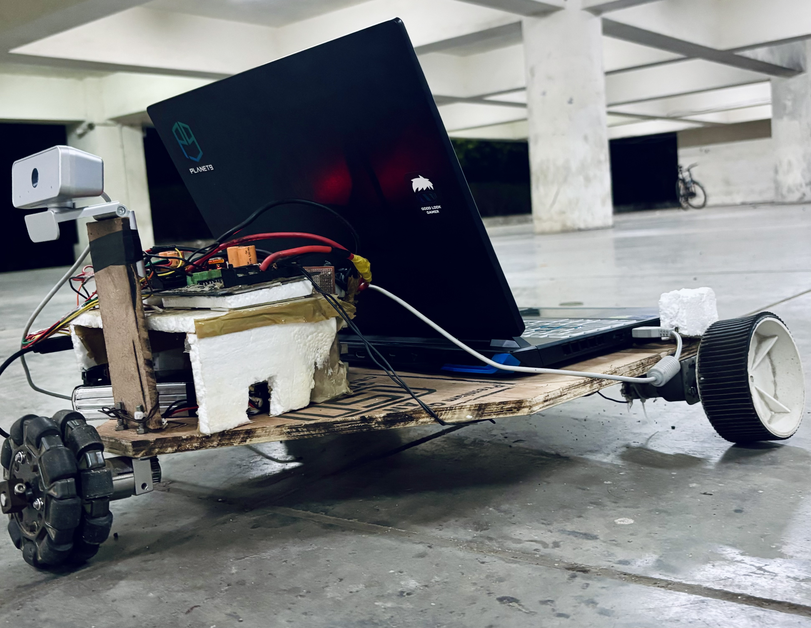

# 🛰️ Object-Following Bot

> **Real-time YOLO-powered rover that locks onto a target and never lets go**  
> Python + OpenCV + PyTorch on an **RTX GPU**, talking over **PySerial** to an **Arduino Mega** that drives twin DC motors through a **20 A Rhino H-bridge**. Built for autonomous tracking, navigation and pure robotics fun.

<p align="center">
  
</p>

[](#model-training)  
[](#software-stack)  
[](LICENSE)

---

## Table of Contents

1. [Features](#features)
2. [Object Dectection using YOLOv8](#The Power of YOLOv8)
3. [Bill of Materials](#bill-of-materials)
4. [Software Stack](#software-stack)

---

## Features

- **Real-time detection & tracking** — up to 30 FPS on RTX 4050 using a custom-trained YOLOv8/v10 model. :contentReference[oaicite:1]{index=1}
- **Autonomous motion** — Arduino firmware translates vision commands (`A B C D f S`) into differential motor speeds for smooth 360° omni-wheel movement. :contentReference[oaicite:2]{index=2}
- **GPU/CPU fallback** — automatically runs on CUDA if available, else falls back to CPU.
- **Obstacle awareness** — HC-SR04 ultrasonic sensor prevents collisions in tight spaces. :contentReference[oaicite:3]{index=3}
- **Modular codebase** — Python scripts for vision & control, Arduino sketch for low-level actuation.
- **Plug-and-play training pipeline** — re-train on your own objects with Roboflow + Google Colab in a few clicks.

---

## 🚀 The Power of YOLOv8

At the heart of this autonomous system lies **YOLOv8 (You Only Look Once)**, a state-of-the-art object detection algorithm renowned for its unparalleled balance of speed and accuracy. Unlike traditional multi-stage detection methods, YOLO processes an entire image in a single pass through a neural network, predicting bounding boxes and class probabilities simultaneously. This unified approach makes it exceptionally fast—a critical factor for real-time applications like our object-following bot.

---

## 🛠️ Custom Training and Optimized Performance

To ensure the bot can reliably identify and track its intended targets, we undertook a **rigorous training process** for our custom YOLOv8 model. This involved:

### 📸 Dataset Preparation

A custom dataset of target objects was meticulously prepared and uploaded to **Google Drive** for seamless access within the Google Colaboratory environment.

### ☁️ Google Colab for Training

[Google Colaboratory](https://colab.research.google.com/) provided a powerful, cloud-based Jupyter notebook environment with **free access to NVIDIA T4 GPUs**, which were indispensable for efficiently processing the computationally intensive task of training our deep learning model.

### 🧠 Model Training

We used the **Ultralytics** library to train the YOLOv8 model. The following command was executed:

```bash
yolo task=detect mode=train model=yolov8s.pt data=data.yaml epochs=25 imgsz=224 plots=True
```

The output of this training yielded two key files:

- `best.pt`: Optimal model checkpoint based on validation performance
- `last.pt`: Final model checkpoint at the end of training

These weights contain the **learned features** necessary for accurate object detection and localization. In deployment, we use a renamed `best.pt` as `ppe.pt`, which is loaded by the bot's inference engine.

When operating, the bot applies these weights to live webcam frames, enabling real-time object recognition and forming the foundation of its **tracking and following behavior**.

## 🏀 Ball Tracking in Action

Witness the bot's object tracking capabilities firsthand! This GIF demonstrates the bot actively tracking and following a ball:

<p align="center">  </p>

## ⚙️ How It Works

The bot's functionality is orchestrated through a sophisticated interplay of software and hardware:

1. **🎥 Video Capture:** A webcam mounted on the bot captures a live video feed.
2. **🖥️ Object Detection (Laptop - NVIDIA RTX 4050 GPU):** The video frames are processed by a Python script running on a laptop. The custom-trained YOLOv8 model detects target objects in real time.
3. **🧠 Command Generation:** Based on the detected object's position (left, center, right), the script generates movement commands (`A`, `B`, `C`, `D`, `f`, `S`) that correspond to directional decisions.
4. **🔌 Serial Communication (PySerial):** These commands are transmitted via USB serial to the **Arduino Mega 2560** using the `pyserial` Python library.
5. **🛞 Motor Control (Arduino Mega 2560):** The Arduino decodes these commands and sends precise PWM signals to a **Rhino MDD20A motor driver**, controlling the **omni-wheels** to move the bot in the desired direction.

---

## Bill of Materials

| Qty                       | Component                         | Purpose                                           |
| ------------------------- | --------------------------------- | ------------------------------------------------- |
| 1                         | **Arduino Mega 2560**             | high-I/O microcontroller brain for motion control |
| 1                         | **Rhino MDD20A** dual 20 A driver | bidirectional DC-motor H-bridge                   |
| 4                         | Omni-wheels                       | holonomic motion                                  |
| 1                         | HC-SR04 ultrasonic sensor         | front obstacle distance                           |
| 1                         | 12 V Li-Po (≥2 Ah)                | power reservoir                                   |
| 1                         | Buck converter (LM2596)           | 12 V → 5 V logic rail                             |
| 1                         | Lenovo FHD USB webcam             | live video stream                                 |
| —                         | Laptop w/ **RTX 4050 GPU**        | on-board compute                                  |
| Pin headers, GCB, jumpers | wiring                            |

_(Full data-sheet style specs live in `'Media/Object following bot.pdf'`)_

---

## Software Stack

| Layer            | Tech                                                     |
| ---------------- | -------------------------------------------------------- |
| **Vision**       | Python 3.10, `ultralytics` (YOLO v8/10), OpenCV 4, NumPy |
| **Acceleration** | PyTorch 2 + CUDA 12                                      |
| **Serial I/O**   | `pyserial`                                               |
| **Annotation**   | `supervision` library                                    |
| **Firmware**     | Arduino IDE 2.x (C++)                                    |

Install everything in one line:

```bash
pip install -r requirements.txt  # Linux / Windows
# or
conda env create -f environment.yml
```
